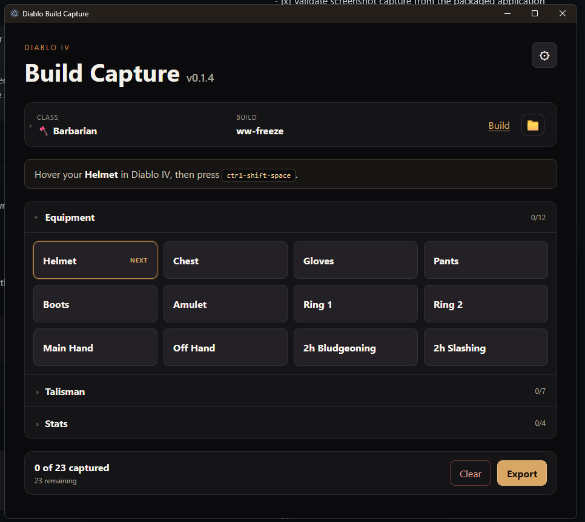

# Diablo Build Capture

A local Windows tool for capturing Diablo IV tooltips and exporting portable
Markdown, JSON, and PNG build snapshots.



## Features

- Sequential capture workflow with one configurable global shortcut.
- Class-specific equipment, talisman, and character-stat slots.
- In-app screenshot preview with zooming, scrollbars, and drag panning.
- Portable Markdown and JSON exports with the captured PNG files.
- Build planner links and configurable export directories.
- Fully local operation with no telemetry or runtime network dependency.

## Getting Started

Prerequisites:

- Windows 11
- Node.js 24
- npm
- Diablo IV in borderless windowed mode (recommended)

```bash
npm install
npm start
```

Electron Forge uses `npm start` for the development build.

## Usage

1. Expand **Build Details** and choose the character class, build name, optional
   planner URL, and output directory.
2. Hover the next tooltip in Diablo IV.
3. Press `Ctrl+Shift+Space` to capture it.
4. Select a specific slot before using the shortcut when replacing an existing
   capture or capturing out of sequence.
5. Review captured images in the preview and repeat until the snapshot is ready.
6. Click **Export** to generate the snapshot and clear the temporary captures.

The application advances through armor, jewelry, weapons, talismans, and
character stats according to the selected class.

## Settings

Open the gear menu to:

- change the global capture shortcut;
- inspect the temporary screenshot directory;
- open or clear temporary captures manually.

## Export Format

Each export creates a timestamped build directory containing:

- `build.md` for Markdown tools and analysis;
- `build.json` for structured processing;
- `items/` with the captured PNG files.

## Development

```bash
npm run typecheck
npm test
npm run package
npm run make
```

- `package` creates the unpacked Electron application.
- `make` creates the Windows installer and other configured distributables.

See [docs/ROADMAP.md](docs/ROADMAP.md) for planned work.

## Project Constraints

- No game automation.
- No process-memory reading.
- No code injection or in-process overlay.
- No OCR yet.
- Captures and exported data remain local.

## Security

The renderer has no direct Node.js access. Every system operation goes through a
limited preload API and explicit IPC handlers, with `contextIsolation` enabled.

## Releases

Run the **Build Windows release** workflow manually from GitHub Actions and
provide a release tag such as `v0.1.4`. The workflow validates the project,
builds the Windows installer, and creates a draft GitHub release for review.
